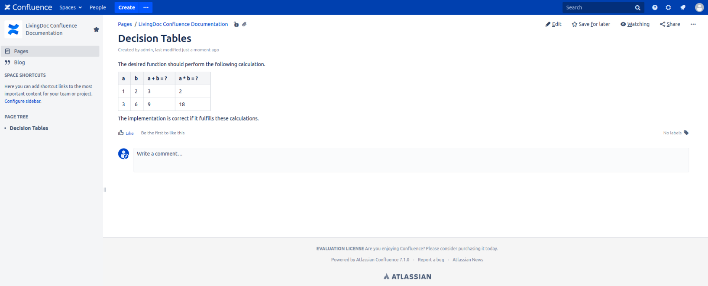

== Creating Fixtures
While writing fixtures in HTML and Markdown are straightforward using tables and list elements, the usage of Confluence needs more details.
In Confluence you work in a different environment than with simple files.

=== Confluence
Working with Confluence is straightforward.
It offers many tools for editing and creating pages.
For a more detailed documentation of how to use the editor in Confluence have a look at the link:https://confluence.atlassian.com/doc/the-editor-251006017.html[official page].

==== Decision Table
A simple Confluence page for a decision table might look like this.
You can insert your tables anywhere on your page, putting text and descriptions before or after them.

image::pic/view.png[Final View]

You can add more calculations by adding more columns.
So you don't have to create multiple tables for the same input values but different calculations/actions.

==== Scenario
To use scenario you need to add a bullet list.
Each entry in this list represents a scenario.
Using the format described earlier a example could look like the following.

image::pic/scenario-final-view.png[]

As well as in decision tables, you can add text before and after the list.
So you can place it wherever you want inside the page.
