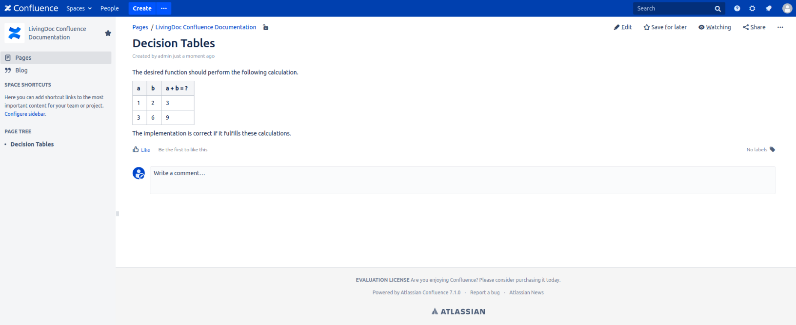

== Storing Test Data
Writing tests in Markdown, HTML and Confluence is easy with the help of the individual tables and list elements, or in the case of confluence an editor.
The following section shows you some examples of how to create your own.

=== Formats

==== Markdown

==== HTML

=== Storage

==== Confluence
Working with Confluence is easy.
It offers many tools for editing and creating pages.
For more detailed documentation on how to use the editor in Confluence, check out the link:https://confluence.atlassian.com/doc/the-editor-251006017.html[official site].

===== Decision Table
A simple confluence page for a decision table could look like this.
You can insert your tables anywhere on the page by placing text and descriptions before or after them.

.Example of decision tables in Confluence

You can add more calculations by adding more columns.
This way you do not have to create multiple tables for the same input values but different calculations/actions.

.Example of a wider decision table in Confluence
image::pic/table-multiple-columns.png[Multiple Columns]

===== Scenario
To use the scenario, you must add an bullet list.
Each entry in this list represents a scenario.
If you use the format described above, an example might look like the following.

.Example of a scenario in Confluence
image::pic/scenario-final-view.png[Scenario Final View]

As in decision tables, you can add text before and after the list.
So you can place it anywhere within the page.

==== File repository

==== Git repository
